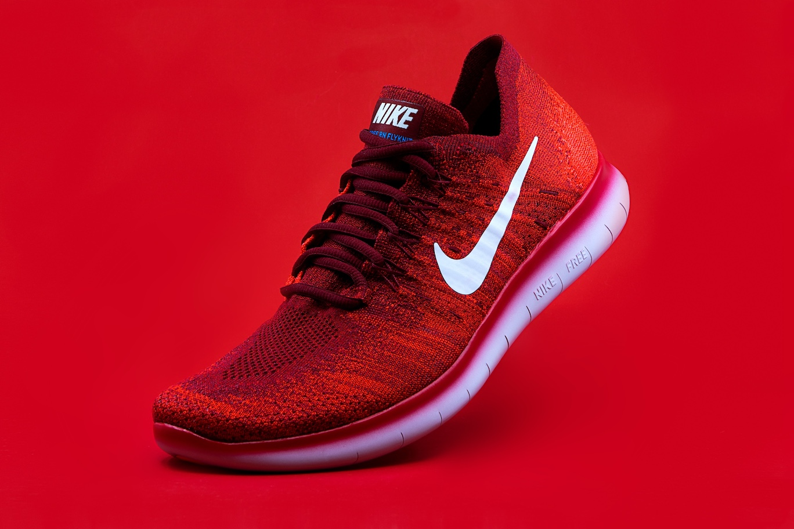

# 👟 E-commerce Shoes Store App (Flutter)

[](https://flutter.dev/)
[](https://dart.dev/)
[](LICENSE)

A beautifully crafted **Flutter-based** shoe store application featuring stunning animations, intuitive navigation, and a modern e-commerce experience. Built with Material Design 3 and powered by the `animate_do` package for smooth transitions.



---

## 🎯 Project Overview

This project is a **complete e-commerce shoe store application** that demonstrates modern Flutter development practices with:
- **Clean Architecture** with organized file structure
- **Smooth Animations** using the `animate_do` package
- **Hero Animations** for seamless page transitions
- **State Management** with StatefulWidget
- **Responsive Design** that works on all screen sizes
- **Material Design 3** components and styling

---

## ✨ Key Features

### 🏪 **Core E-commerce Features**
- 🛍️ **Dynamic Product Catalog** with 8+ shoe models
- 🔍 **Real-time Search** functionality
- 📱 **Responsive Grid Layout** (2-column design)
- 💖 **Favorites System** with toggle functionality
- 🛒 **Shopping Cart** with item counter
- 📦 **Product Categories** (All, Sneakers, Football, Soccer, Golf)
- � **Price Display** in Indian Rupees (₹)

### 🎨 **UI/UX Excellence**
- ⚡ **Smooth Animations** powered by `animate_do`
- 🦸 **Hero Animations** for product transitions
- 🎪 **Category Icons** with animated selection
- � **Material Design 3** components
- 🌈 **Gradient Overlays** and modern styling
- 👆 **Interactive Elements** with visual feedback

### 🔧 **Technical Features**
- 📱 **Cross-platform** (Android, iOS, Web, Desktop)
- 🔄 **State Management** with efficient rebuilds
- 🎯 **Navigation System** with named routes
- � **Clean Code Structure** with separation of concerns
- 🖼️ **Optimized Image Loading** with Hero widgets

---

## 📱 App Structure & Pages

### 🏠 **Home Page** (`home_page.dart`)
- **Product Grid**: Displays shoes in a 2x4 grid layout
- **Category Filter**: Horizontal scrollable category buttons
- **Search Bar**: Real-time product filtering
- **Navigation**: AppBar with cart, favorites, and notifications
- **Animations**: FadeInUp animations for grid items

### 👟 **Product Detail Page** (`shoes_page.dart`)
- **Hero Animation**: Smooth transition from grid
- **Size Selection**: Interactive size picker (40, 42, 44, 46)
- **Full-Screen Image**: Immersive product view
- **Purchase Button**: "Buy Now" with confirmation dialog
- **Gradient Overlay**: Modern dark gradient design

### 💖 **Favorites Page** (`favorites_page.dart`)
- **Favorite Items List**: Shows all favorited products
- **Quick Navigation**: Tap to view product details
- **Hero Integration**: Smooth transitions to product page
- **Empty State**: User-friendly message when no favorites

### � **Cart Page** (`cart_page.dart`)
- **Cart Items List**: Displays added products
- **Total Calculation**: Dynamic price calculation
- **Remove Items**: Cart management functionality
- **Empty State**: Clear messaging for empty cart

### 🔔 **Notifications Page** (`notifications_page.dart`)
- **Push Notifications**: App updates and offers
- **Promotional Messages**: Sales and new arrivals
- **User Engagement**: Keep users informed

---

## 🏗️ Project Architecture

### 📂 **File Structure**
```
lib/
├── main.dart              # App entry point & routing
├── home_page.dart         # Main product catalog
├── shoes_page.dart        # Product detail view
├── favorites_page.dart    # Favorites management
├── cart_page.dart         # Shopping cart
└── notifications_page.dart # User notifications

assets/
└── images/               # Product images (12 items)
    ├── one.jpg - twelve.jpg
```

### 🎯 **Data Models**
```dart
class Shoe {
  final String image;    # Asset path
  final String tag;      # Unique identifier
  final String brand;    # Nike, Adidas, Puma, etc.
  final String category; # Sneakers, Football, Soccer, Golf
  final int price;       # Price in rupees
  bool isFavorite;       # Favorite status
}
```

### 🛣️ **Navigation Routes**
- `/` → HomePage (Default)
- `/favorites` → FavoritesPage
- `/cart` → CartPage
- `/notifications` → NotificationsPage

---

## 🚀 Getting Started

### 📋 **Prerequisites**
- **Flutter SDK**: `>=3.0.6` (latest stable)
- **Dart SDK**: `>=3.0.0`
- **IDE**: Android Studio, VS Code, or IntelliJ
- **Device**: Physical device or emulator

### ⚙️ **Installation Steps**

1. **📥 Clone the Repository**
```bash
git clone https://github.com/Sandarsh18/ecommerce-shoes.git
cd ecommerce-shoes
```

2. **📦 Install Dependencies**
```bash
flutter pub get
```

3. **🔍 Verify Installation**
```bash
flutter doctor
```

4. **▶️ Run the Application**
```bash
# For development
flutter run

# For release build (Android)
flutter build apk --release

# For release build (iOS)
flutter build ios --release
```

---

## 📦 Dependencies

### 🎯 **Core Dependencies**
```yaml
dependencies:
  flutter:
    sdk: flutter
  animate_do: ^3.1.2          # 🎬 Smooth animations
  cupertino_icons: ^1.0.2     # 🍎 iOS-style icons

dev_dependencies:
  flutter_test:
    sdk: flutter               # 🧪 Testing framework
```

### 📚 **Package Details**
- **`animate_do`**: Provides pre-built animation widgets like `FadeInUp`, `SlideInLeft`
- **`cupertino_icons`**: Apple-style icons for cross-platform consistency
- **`flutter_test`**: Built-in testing framework for unit and widget tests

---

## 🎨 UI Components & Animations

### 🎭 **Animation Timeline**
- **Category Buttons**: 300ms scale animation on selection
- **Product Grid**: Staggered FadeInUp (1200ms + 100ms per item)
- **Product Detail**: 1000ms FadeInUp for bottom sheet
- **Size Buttons**: Individual FadeInUp (1450-1600ms)
- **Hero Transitions**: Automatic Flutter Hero animation

### 🎨 **Design System**
- **Primary Colors**: Black & White contrast
- **Accent Colors**: Dynamic based on product images
- **Typography**: Bold headers, clean body text
- **Spacing**: 20px base padding, 15px grid spacing
- **Border Radius**: 20px for cards, 25px for buttons

---

## 📱 Screenshots & Demo

### 🖼️ **App Screens**
| 🏠 Home Screen | 👟 Product Detail | 💖 Favorites | 🛒 Cart |
|---------------|-------------------|-------------|--------|
| Product grid with categories | Full-screen product view | Saved favorites list | Shopping cart items |
| Search & filter options | Size selection | Quick product access | Total price calculation |
| Animated transitions | Hero animations | Empty state handling | Cart management |

### 🎥 **Key Interactions**
- **🔍 Search**: Real-time filtering as you type
- **🏷️ Category Filter**: Smooth selection animations
- **💖 Favorite Toggle**: Instant heart animation
- **🛒 Add to Cart**: Snackbar confirmation
- **📱 Product Tap**: Hero animation to detail page
- **📏 Size Selection**: Interactive size picker

---

## 🔧 Technical Implementation

### 🎯 **State Management**
- **StatefulWidget**: Used for local component state
- **setState()**: Efficient rebuilds for UI updates
- **Data Flow**: Props passing between widgets

### 🎨 **Animation Implementation**
```dart
// Staggered grid animations
FadeInUp(
  duration: Duration(milliseconds: 1200 + index * 100),
  child: buildShoeCard(filteredShoes[index]),
)

// Hero transitions
Hero(
  tag: shoe.tag,
  child: Container(...),
)
```

### 🔍 **Search & Filter Logic**
```dart
List<Shoe> get filteredShoes {
  return shoes.where((shoe) {
    final matchCategory = selectedCategory == 'All' || 
                         shoe.category == selectedCategory;
    final matchSearch = shoe.brand.toLowerCase()
                           .contains(searchQuery.toLowerCase());
    return matchCategory && matchSearch;
  }).toList();
}
```

---

## 🛠️ Development Commands

### 🏃‍♂️ **Running the App**
```bash
# Debug mode (hot reload enabled)
flutter run

# Release mode
flutter run --release

# Profile mode (performance analysis)
flutter run --profile

# Specific device
flutter run -d <device-id>
```

### 🧪 **Testing**
```bash
# Run all tests
flutter test

# Run with coverage
flutter test --coverage

# Widget tests
flutter test test/widget_test.dart
```

### 🏗️ **Building**
```bash
# Android APK
flutter build apk

# Android App Bundle
flutter build appbundle

# iOS
flutter build ios

# Web
flutter build web
```

---

## 📊 Performance & Optimization

### ⚡ **Performance Features**
- **Efficient Rebuilds**: Minimal setState() usage
- **Image Optimization**: Hero widgets for smooth transitions
- **Lazy Loading**: GridView with automatic viewport management
- **Memory Management**: Proper widget disposal

### 📱 **Platform Support**
- ✅ **Android** (API 21+)
- ✅ **iOS** (iOS 11.0+)
- ✅ **Web** (Chrome, Firefox, Safari)
- ✅ **Desktop** (Windows, macOS, Linux)

---

## 🌟 Future Enhancements

### 🚀 **Planned Features**
- 🔐 **User Authentication** (Firebase Auth)
- 💳 **Payment Integration** (Razorpay/Stripe)
- 🌍 **Multi-language Support**
- 🌙 **Dark Mode Theme**
- 📊 **Analytics Integration**
- 🔔 **Push Notifications**
- ⭐ **Product Reviews & Ratings**
- 🎯 **Recommendation Engine**

### 🛠️ **Technical Improvements**
- 📱 **State Management**: Bloc/Riverpod implementation
- 🏗️ **Clean Architecture**: Repository pattern
- 🧪 **Testing**: Unit, widget, and integration tests
- 🌐 **API Integration**: REST/GraphQL backend
- 📦 **CI/CD Pipeline**: Automated builds and deployments

---

## 🤝 Contributing

### 🎯 **How to Contribute**
1. **🍴 Fork** the repository
2. **🌟 Create** a feature branch (`git checkout -b feature/AmazingFeature`)
3. **💡 Commit** your changes (`git commit -m 'Add some AmazingFeature'`)
4. **📤 Push** to the branch (`git push origin feature/AmazingFeature`)
5. **🔄 Open** a Pull Request

### 📋 **Contribution Guidelines**
- Follow **Flutter style guide**
- Add **comments** for complex logic
- Include **tests** for new features
- Update **documentation** as needed
- Ensure **no breaking changes**

---

## 📄 License

This project is licensed under the **MIT License** - see the [LICENSE](LICENSE) file for details.

```
MIT License

Copyright (c) 2024 Sandarsh18

Permission is hereby granted, free of charge, to any person obtaining a copy
of this software and associated documentation files (the "Software"), to deal
in the Software without restriction, including without limitation the rights
to use, copy, modify, merge, publish, distribute, sublicense, and/or sell
copies of the Software.
```

---

## 👤 Author

**Sandarsh18**
- 🌐 GitHub: [@Sandarsh18](https://github.com/Sandarsh18)
- 📧 Email: [your-email@example.com](mailto:your-email@example.com)
- 💼 LinkedIn: [Your LinkedIn Profile](https://linkedin.com/in/your-profile)

---

## 🙏 Acknowledgments

- 🎨 **Flutter Team** - For the amazing framework
- 📦 **animate_do** - For smooth animation package
- 🎯 **Material Design** - For design guidelines
- 👥 **Flutter Community** - For inspiration and support
- 🖼️ **Image Assets** - Product images used in the app

---

## 📞 Support

### 🆘 **Need Help?**
- 📖 **Documentation**: Check Flutter docs
- 💬 **Issues**: Create a GitHub issue
- 🤔 **Questions**: Start a discussion
- 📧 **Contact**: Reach out via email

### 🐛 **Found a Bug?**
Please create an issue with:
- 📱 Device information
- 🔄 Steps to reproduce
- 📷 Screenshots (if applicable)
- 📋 Error logs

---

## ⭐ Star This Project

If you found this project helpful, please consider giving it a ⭐ on GitHub!

---

<div align="center">
  
**🎉 Happy Coding! 🎉**

Made with 💖 using Flutter

</div>

